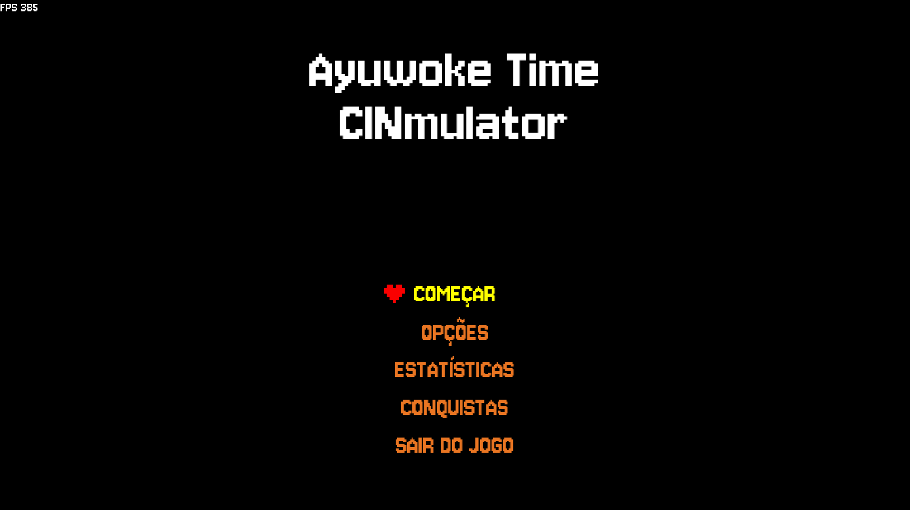
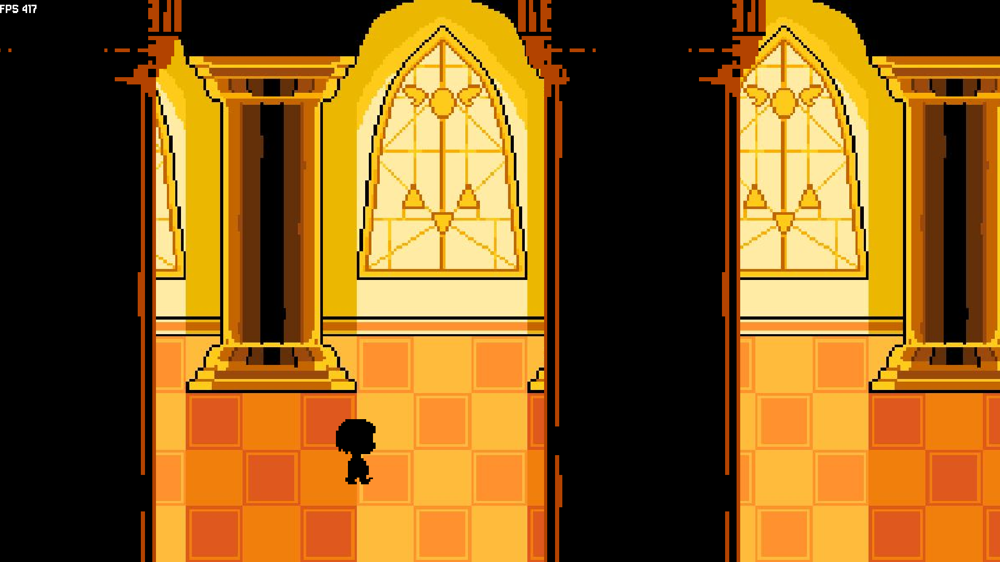
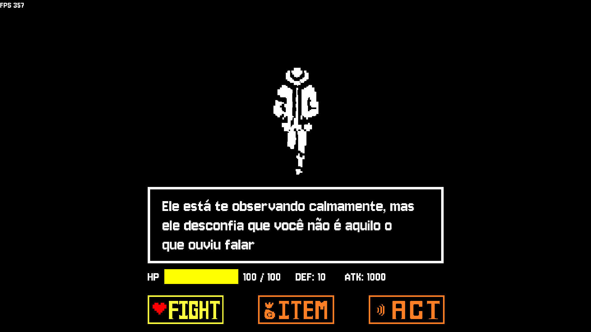
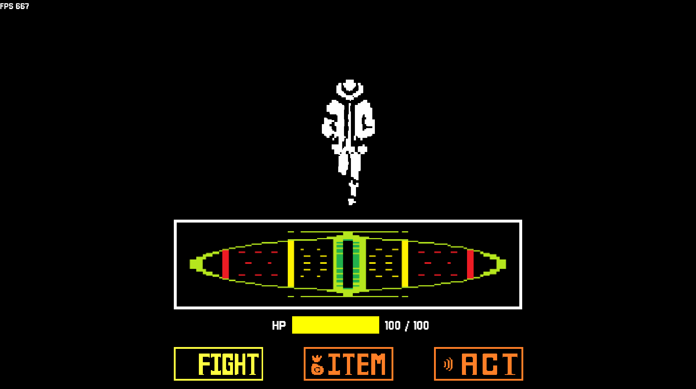
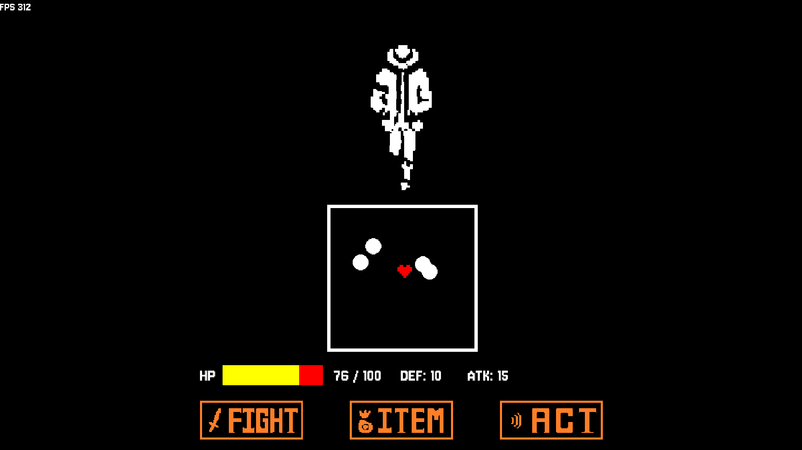
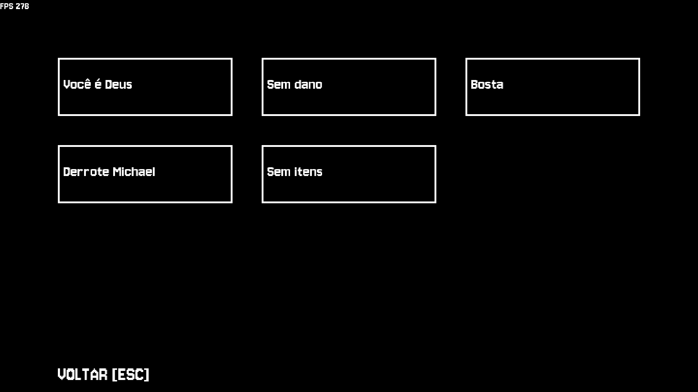

# Ayuwoke Time Cinmulator 🎮

Projeto final desenvolvido para a disciplina de **Introdução à Programação** do Centro de Informática (CIn) - UFPE. O projeto consiste em um jogo focado em mecânicas de exploração e sistema de batalha em turnos (estilo RPG), fortemente inspirado em *Undertale*.



---



## 👥 Membros da Equipe

* **Bruno Rodrigues e Silva** — [brs3@cin.ufpe.br](mailto:brs3@cin.ufpe.br)
* **João Eduardo Teixeira de Carvalho Gondim Lavieri** — [jetcgl@cin.ufpe.com.br](mailto:jetcgl@cin.ufpe.com.br)
* **Gabriel Almeida de Lima** — [gal2@cin.ufpe.com.br](mailto:gal2@cin.ufpe.com.br)
* **Lucas Rafhael dos Santos Andrade** - [lrsa2@cin.ufpe.br](mailto:lrsa@cin.ufpe.br)
* **Arthur Jordão Saraiva Leão** - [ajsl@cin.ufpe.br](mailto:ajsl@cin.ufpe.br)
* **Fabrício Fernandes Alves da Silva** - [ffas@cin.ufpe.br](mailto:ffas@cin.ufpe.br)

---

## 📐 Arquitetura do Projeto e Organização do Código

O projeto foi estruturado seguindo boas práticas de modularização para desenvolvimento de jogos de forma escalável. A organização das pastas e arquivos reflete a separação de responsabilidades do sistema:

```text
src
├── assets/          # Recursos estáticos divididos por tipo (fontes, imagens e efeitos sonoros).
├── core/            # O núcleo do motor do jogo (loop principal, inputs, configurações e assets managers).
├── components/      # Sistemas e comportamentos genéricos acopláveis (animação, filemanager, câmera, máquina de estados).
├── entities/        # Objetos dinâmicos do jogo que possuem comportamento próprio (player, boss, coletáveis).
├── scenes/          # Gerenciamento das telas do jogo (menus, transições) e sub-estados do combate.
└── utilities/       # Funções matemáticas e filtros auxiliares.
```

## 📁 Principais Módulos

| Arquivo | Responsabilidade |
|---|---|
| `main.py` | Ponto de entrada (boot) que inicializa e delega a execução para o núcleo do sistema |
| `core/app.py` | Centraliza o loop principal (Event Loop), gerenciando FPS, atualizações de estado e renderização |
| `scenes/scene.py` & `scenes/states/` | Controle de telas via polimorfismo — alterna entre Introdução, Menu, Configurações e Cena de Jogo (`game.py`), que gerencia os estados de batalha (Act, Attack, Fight, Item) |
| `components/statemachine.py` | Máquina de Estados que controla o estado/cena do jogo |

---

## 🛠️ Ferramentas, Bibliotecas e Frameworks

### Python (v3.11+)
Linguagem padrão da disciplina. A versão 3.11+ foi escolhida para utilizar recursos modernos de tipagem estática e otimizações de performance em tempo de execução.

### Pygame
Biblioteca robusta e multiplataforma para desenvolvimento de jogos 2D em Python. Fornece abstrações essenciais para manipulação de superfícies, renderização de imagens, controle de áudio (mixers) e captura de eventos de hardware (teclado, mouse e joysticks).

### Bibliotecas padrão do pytho
Bibliotecas como os, sys e math foram usadas para configurações do jogo e cálculos específicos.

---

## 📋 Conceitos de Programação Utilizados

### 1. Estruturas de Dados e Dicionários
- **Onde foi usado:** `components/items_info.py`, `core/constants.py`, `core/inputs.py`, etc — mapeamento de propriedades de itens, constantes de sistema, mapeamento de inputs, etc.
- **Técnica Avançada:** Desempacotamento de dicionários (`**kwargs`) em `core/setup.py` para passar parâmetros de configuração ao Pygame de forma limpa e legível.

### 2. Modularização e Pacotes (`__init__.py`)
- **Onde foi usado:** Todos os diretórios (`core`, `components`, `scenes`, etc.). O `__init__.py` transforma as pastas em pacotes Python reutilizáveis, permitindo importações limpas entre os sub-módulos.

### 3. Tipagem Dinâmica e Avançada (Type Hinting)
- **Onde foi usado:** Aplicado em todo o código para garantir robustez. Tipos explícitos em parâmetros e retornos de funções, minimizando erros de atribuição no desenvolvimento em grupo.

### 4. Programação Orientada a Objetos (POO) e Herança
- **Onde foi usado:** Arquitetura de cenas e entidades. Classes base como `scenes/scene.py` e `components/object.py` definem contratos genéricos (`update` e `draw`) herdados e sobrescritos por `entities/player.py`, `scenes/menu.py` e outras.

### 5. Documentação Ativa (Docstrings)
- **Onde foi usado:** Funções estruturais complexas documentadas com docstrings, facilitando a leitura via autocompletar nas IDEs de cada membro da equipe.

---

## 👥 Divisão de Trabalho

### Bruno Rodrigues
- Estrutura principal do jogo;
- Mecânicas de animações e diálogos;
- Troca de estados do jogo;
- Sprites e soundtracks;
- Manuseio de eventos disparados pelo jogador;
- Features extras.

### João Eduardo
- Criação da tela de vitória e de gameover;
- Pontuação dos coletáveis;
- Sons do jogo e ataques;
- Criação de sprites.

### Gabriel Almeida
- Criação do menu principal;
- Cena de Créditos iniciais;
- Mecânica do jogador;
- Mecânica dos itens;
- Criação de ataques.

### Lucas Rafhael
- Criação de ataques principais;
- Desenvolvimento e apuração da estratégia de batalha.

### Arthur Jordão
- Criação dos ataques.

### Fabrício Fernandes
- Criação da história principal do jogo;
- Traduções e diálogos;
- Cena final;
- Criação de sprites.

---

## Erros e Desafios

### O MAIOR ERRO DURANTE O PROJETO:
A falta de uma estrutura já consolidada no início. Para resolver, foi preciso parar o avanço do projeto para refazer a estrutura, evitando muitas refatorações no futuro.

### O MAIOR DESAFIO DURANTE O PROJETO:
O manejo adequado e funcional do Pygame, o motor base do jogo. Como solução, resolvemos estudar um pouco mais afundo a biblioteca antes de prosseguir para mecânicas mais complexas.

### LIÇÕES APRENDIDAS NO PROJETO:
Aprendemos a classificar a ordem de importância das tarefas; a como trabalhar em equipe pela divisão de tarefas; como ter uma comunicação clara do que deve ser feito.

---

## Galeria do Projeto







